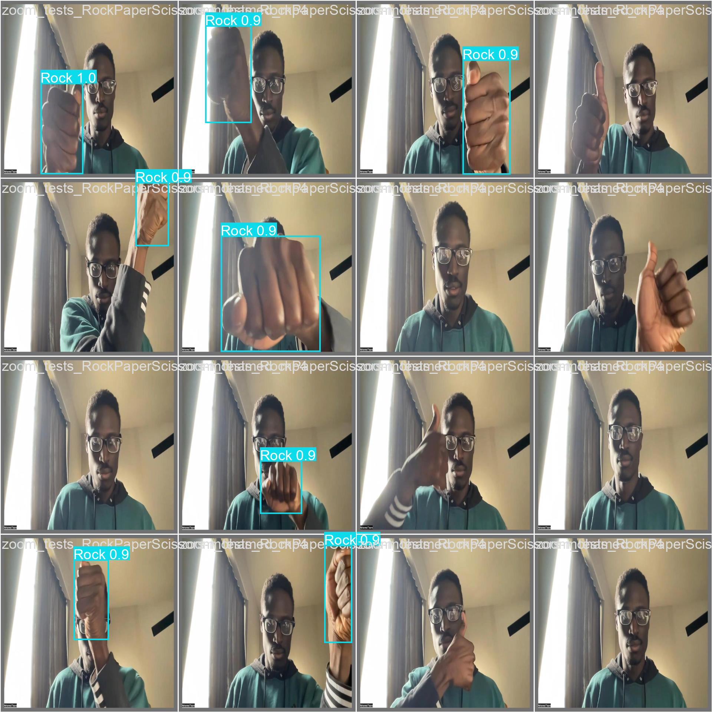
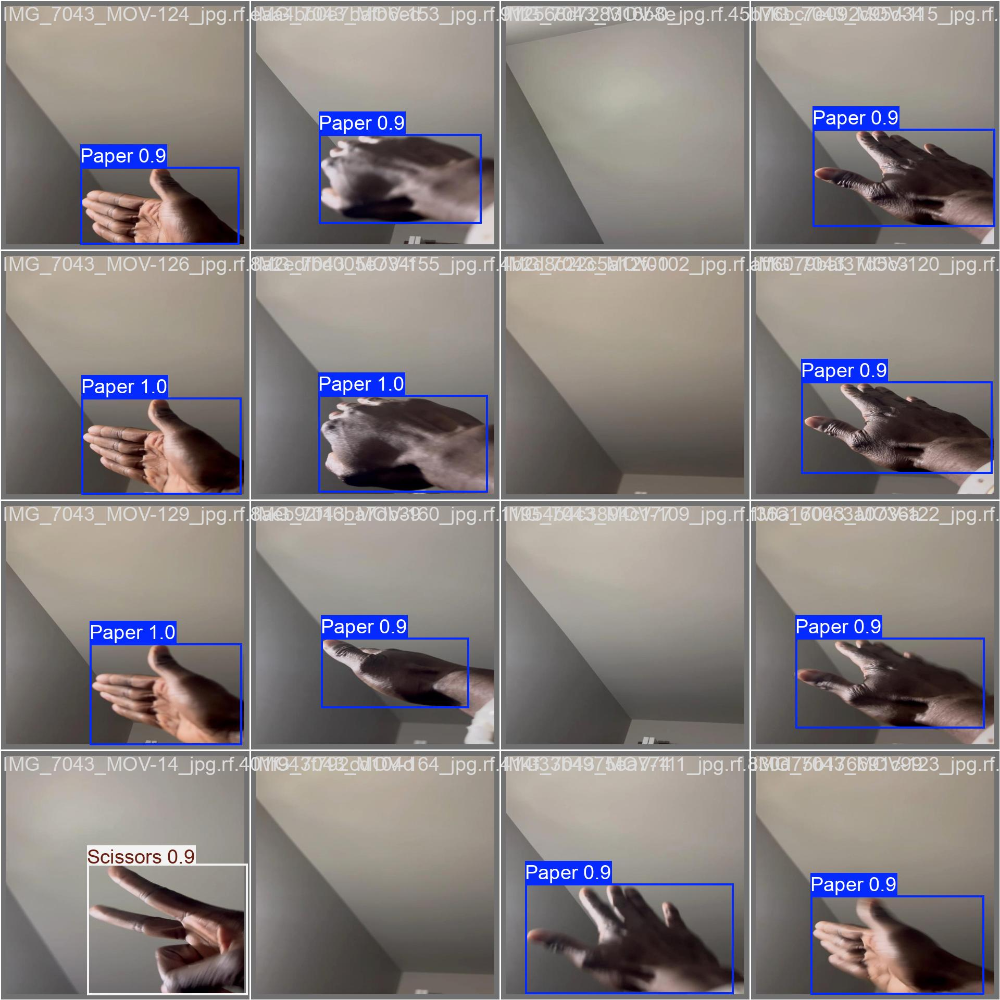
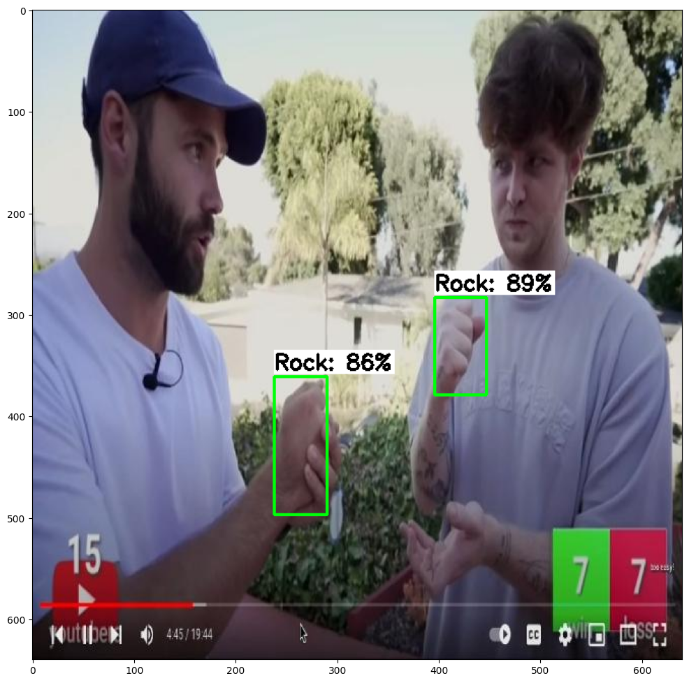
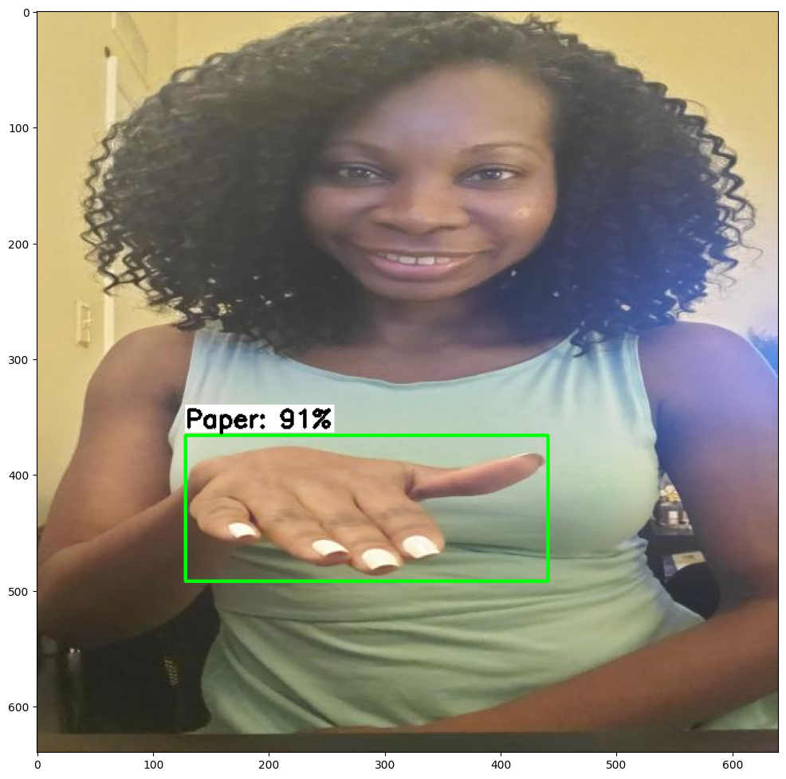
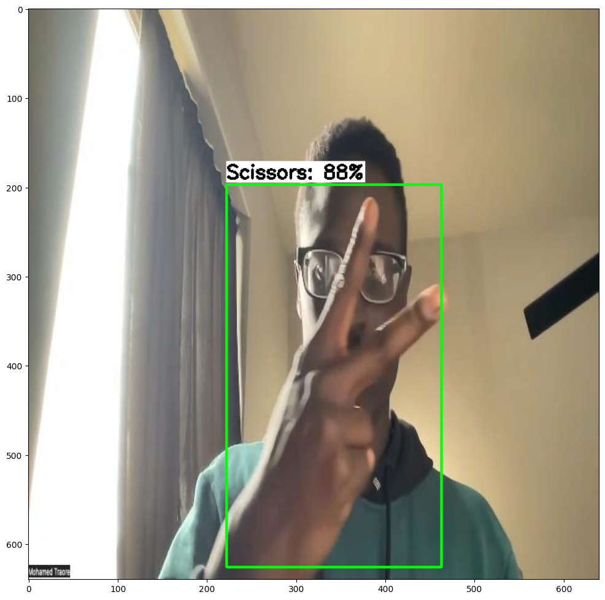

# Model Comparison: YOLO vs. MobileNet

## 1. Introduction
In this comparison, we evaluate the object detection performance of two models:
- **YOLO (You Only Look Once)**: A real-time object detection model known for its speed and accuracy.
- **MobileNet**: A lightweight convolutional neural network optimized for mobile and embedded vision applications.

Both models are evaluated on the same dataset and images to compare their detection accuracy, speed, and overall performance.

## 2. Model Specifications

| Metric            | YOLO                         | MobileNet                    |
|-------------------|------------------------------|------------------------------|
| **Model Size**     | 12.2mb               | 43.9mb                |
| **Input Image Size** | 640x640            | 320x320              |
| **Training Data**  | rock-paper-scissors  | rock-paper-scissors  |
| **Architecture**   | CNN-based, uses bounding boxes | CNN-based, uses bounding boxes       |
| **Framework**      | Ultralytics YOLOv           | TensorFlow + MobileNetV2     |

## 3. Performance Metrics

| Metric                | YOLO                            | MobileNet                         |
|-----------------------|---------------------------------|-----------------------------------|
| **mAP50 (Mean Average Precision)** | 95.2%          | 88.98%                   |
| **mAP50-95 (Mean Average Precision)** | 96.3%          | 63.83%                   |
| **Precision**          | 95.4%                 | 73.20%                   |
| **Recall**             | 91.9%                 | 92.26%                   |
| **Inference Time**     | 7.1ms     | 70ms       |

## 4. Sample Detections

### YOLO Model

#### Image 1

**Detection Summary:**
- Detected Objects: (Rock)
- Confidence Levels: (Rock: 90%)

#### Image 2

**Detection Summary:**
- Detected Objects: (Paper, Scissors)
- Confidence Levels: (Paper: 90%, Scissors: 90%)

### MobileNet Model

#### Image 1

**Detection Summary:**
- Detected Objects: (Rock)
- Confidence Levels: (Rock: 86%, Rock: 89%)

#### Image 2

**Detection Summary:**
- Detected Objects: (Paper)
- Confidence Levels: (Paper: 91%)

#### Image 3

**Detection Summary:**
- Detected Objects: (Scissors)
- Confidence Levels: (88%)

## 5. Comparative Analysis

### Detection Accuracy
- **YOLO**: In contrast with MobileNet, YOLO scored much higher, at **96%** mAP and a **95.4%** precision score. Such outcomes indicate that the YOLO method correctly detects objects with high accuracy and precision score. It is therefore suitable in situations that require authentic object detection.
- **MobileNet**: The mAP that was achieved by MobileNet value at **63.83%**, which actually shows performance on object detection tasks to be moderate. Its precision score at **73%** indicates that a very large proportion of its positive predictions are correct and accurately result in true positive detections. Moreover, at a recall of 92%, MobileNet even showed its capability in yielding a high proportion of actual positive instances. Although these results show how well MobileNet simply and effectively detects objects, its mAP indicates some potential room to raise above that of YOLO's result at **95%**. As such, in applications focusing more on efficiency, MobileNet can be a very viable choice however, the applications with greater precision may favor the use of YOLO.

### Speed and Efficiency
- **YOLO**: The YOLO executable results in an inference time of only 7.1 milliseconds that is, significantly lower than MobileNet and therefore means that YOLO can do highly efficient real-time object detection, the need for which is critical in video surveillance, autonomous driving, and other applications where decisions must be taken instantaneously. MobileNet, while optimized for efficiency, consumes much more time for its inference, which can adversely affect its performance in tasks requiring timely response. Combining high accuracy with fast inference speeds, YOLO is good for developers who seek best-in-class performance in the real world.
- **MobileNet**: Inference times for MobileNet were around 70 milliseconds, meaning it is optimized for efficiency but at the cost of being much slower than YOLO. With inference time of 7.1 milliseconds, this renders a longer inference time a potential limitation, especially for the applications requiring real-time processing, such as video analysis or interactive systems, where immediate response is a priority. Although MobileNet performs well, in terms of accuracy and recall rates, the inference time being slower might make it less usable in fast environments, compared to YOLO. Where speed of detection is at the top of the list, YOLO will always have a natural advantage with its fast detection.

### Use Cases
- **YOLO**: Best suited for applications such as real-time detection and high accuracy, where accuracy cannot be compromised: application scenario - autonomous vehicles, dynamic object tracking, surveillance cameras in real-time in several environments. It has excellent potential for very fast inference times and superior multi-object performance.
- **MobileNet**: It is ideal for low power devices and applications where there is a need for speed while still preferring light models.    Its architecture allows for efficient deployment on mobile and edge devices for applications such as mobile image classification apps, real time object detection in drones among others. Even though it has a little compromise with regard to the precision in comparison to YOLO, MobileNet is helpful as a relatively high-performing balance of performance and computational efficiency, that's very popular in the developers' terms for optimizing speed with resource conservation. 

## 6. Conclusion
Based on the comparison, we can conclude:
- **YOLO**It is commendable because of its accuracy and real-time detection capabilities, which make it especially suitable for applications requiring the identification of objects with high precision in dynamic scenarios. Its inference time is also rapid, making it even more effective for tasks requiring swift responses.
, while **MobileNet** is larger and resource-efficient, hence suitable for low-power devices and scenarios where lightweight models are preferred. It strikes a good balance between speed and performance, which is beneficial to applications on mobile or edge devices.
- After all, both models have pros. The choice of one of the models will depend on the application requirements—whether you prefer accuracy and speed by choosing YOLO or more efficient and lightweight deployment by choosing MobileNet.

---

**Next Steps**:
Further tuning and optimizing the models may improve their performance in specific scenarios. Future work may include experimenting with hybrid approaches or using different datasets for more extensive evaluation.
